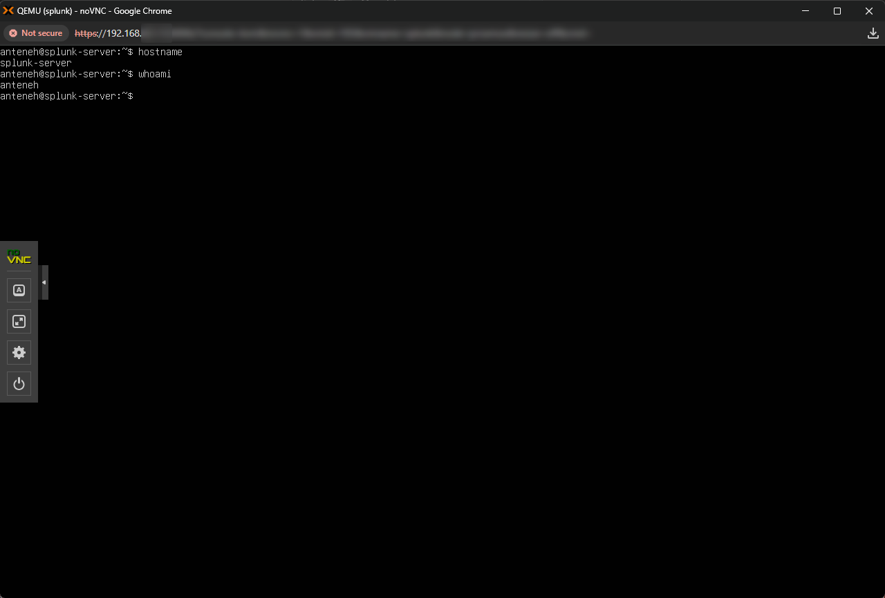
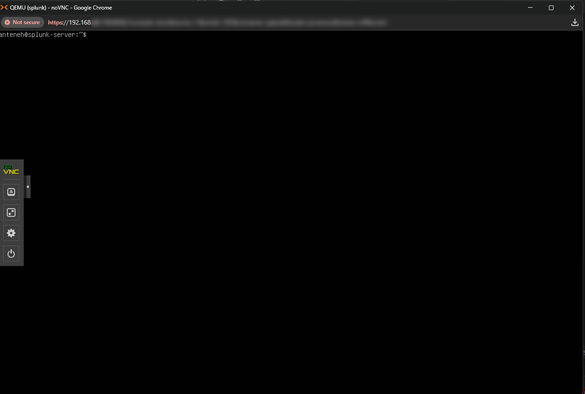

## System Validation (Pre-Splunk Installation)

### Access Verification
- Successfully logged into Ubuntu server
- Terminal access confirmed
- Hostname configured as "splunk-server"
- User account operational

### Environment Details
- Virtualized on Proxmox
- Network configured via DHCP
- SSH enabled for remote access

### System Ready State
The server is fully configured and ready for Splunk installation.
