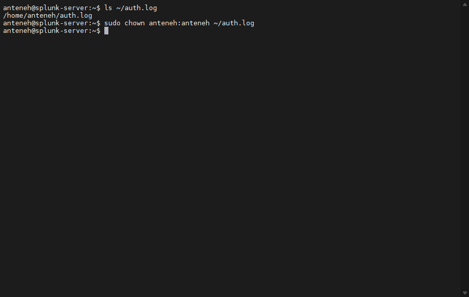

## Data Ingestion

Accessed Splunk “Add Data” interface to begin ingesting system logs.


Copied Linux authentication logs (auth.log) for ingestion into Splunk.


## Issue: Permission Denied on Log File

### Problem
Encountered "permission denied" error when accessing auth.log file.

### Resolution
Changed file ownership to current user:

```bash
sudo chown anteneh:anteneh ~/auth.log
```


### Outcome

Successfully gained access to log file for ingestion into Splunk.

---

# 🔥 Alternative (pro-level knowledge)

Instead of changing ownership, we could also use:

```bash
sudo chmod +r ~/auth.log
```
