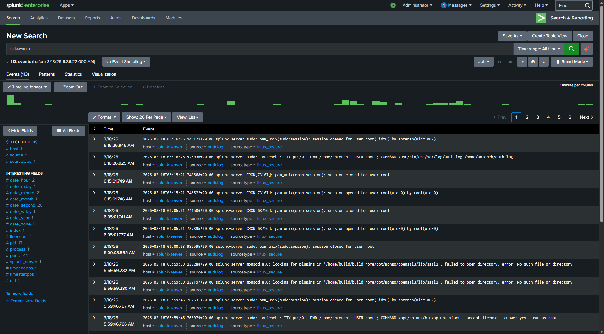
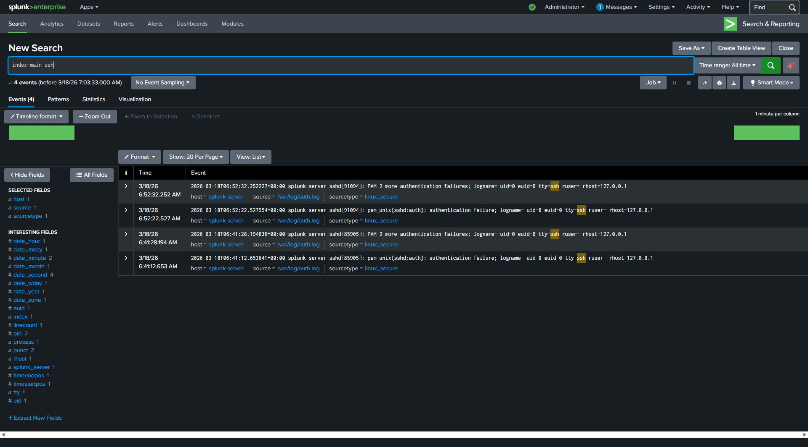

## Data Upload Completion

Successfully uploaded auth.log into Splunk.
Data is now indexed and ready for search and analysis.

## Initial Log Search

Executed search query:

index=main

Successfully retrieved system logs including:
- sudo activity
- cron jobs
- user sessions

Confirmed that log ingestion and indexing are working correctly.

## Simulated Attack: Failed SSH Logins

Performed multiple failed SSH login attempts using a non-existent user account.

Purpose:
Generate authentication failure events for detection testing.

## Live Log Monitoring Setup

Selected "Monitor" option in Splunk to enable real-time log ingestion.

Configured Splunk to monitor files and directories for continuous log ingestion.

## Live Log Monitoring Configuration

Configured Splunk to monitor the Linux authentication log file located at:

/var/log/auth.log

Logs are indexed under the "main" index using the linux_secure source type.

This enables real-time ingestion of authentication events.

## Log Ingestion Mechanism

Splunk was configured to monitor the file /var/log/auth.log.

Rather than redirecting logs manually, Splunk continuously reads new entries from the file as they are written by the operating system.

This allows real-time ingestion of authentication events such as SSH login attempts.

## Detection: Failed Logins by IP

Used regex extraction to identify source IPs from authentication logs.

Query:

index=main "Failed password"
| rex "from (?<src_ip>\d+\.\d+\.\d+\.\d+)"
| stats count by src_ip

This allows identification of potential brute-force attempts.

## Detection: Failed SSH Authentication Attempts by Source IP

Analyzed authentication logs to identify repeated failed login attempts and determine the originating source IP.

Executed query:

index=main ssh
| rex "rhost=(?<src_ip>\d+\.\d+\.\d+\.\d+)"
| stats count by src_ip
| sort -count

### Analysis

The query extracts the source IP address from SSH authentication failure events and aggregates the number of attempts per IP.

This allows identification of hosts generating repeated failed login attempts, which may indicate brute-force activity.

### Result

Observed multiple failed authentication attempts originating from a single source IP (127.0.0.1), corresponding to simulated attack activity.

### Insight

This demonstrates the ability to:
- Parse unstructured log data using regex
- Identify patterns of suspicious authentication behavior
- Correlate events by source to detect potential threats

This approach can be extended to detect brute-force attacks and trigger alerts based on defined thresholds.
